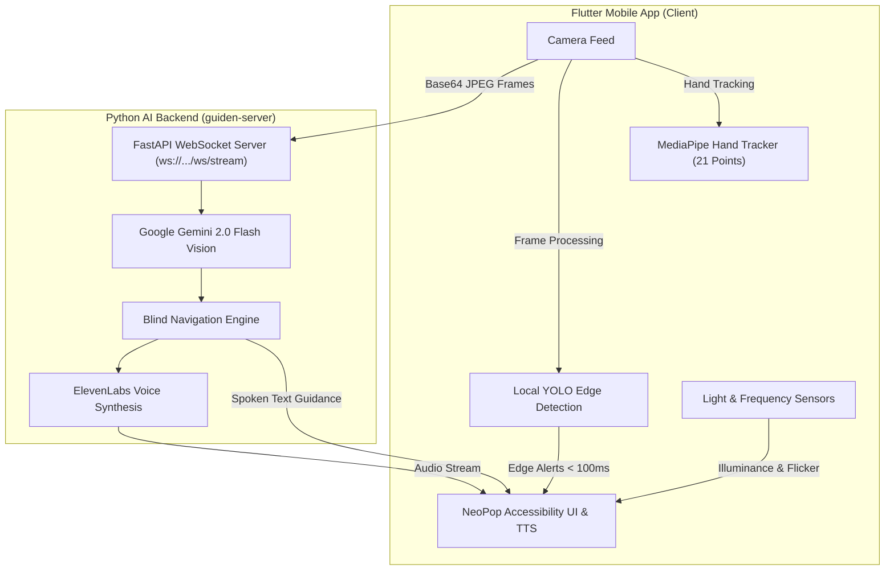

# Guiden 👁️⚡

> **AI-Powered Real-Time Spatial Intelligence & Navigation Assistant for the Visually Impaired**

[](https://flutter.dev)
[](https://dart.dev)
[](https://python.org)
[](https://fastapi.tiangolo.com)
[](https://ai.google.dev)
[](LICENSE)

**Guiden** is an assistive AI platform built to act as eyes for visually impaired and blind individuals. By combining real-time eye-level video streaming, cloud-based Multimodal Vision AI (Google Gemini 2.0 Flash), on-device edge object detection (Ultralytics YOLO), MediaPipe hand keypoint tracking, and ambient light/frequency sensing, Guiden delivers continuous, non-hallucinatory step-by-step spatial navigation.

---

## 🌟 Key Features

- 🚶 **Continuous Real-Time Navigation Guidance**: Streams live camera frames to an AI backend that analyzes walkable floor space, visible obstacle bounds, and safe step distances in real time.
- 🛡️ **Anti-Hallucination Safety Engine**: Follows strict floor-first rules to issue conservative 2–4 sentence spoken step commands based *strictly* on visible floor clearance.
- ⚡ **Local Edge Obstacle Detection**: Runs local Ultralytics YOLO models on-device for ultra-low latency (<100ms) safety alerts when obstacles suddenly enter the user's path.
- 🖐️ **21-Keypoint MediaPipe Hand Landmark Tracking**: Tracks hand positions in real time for touch-free gesture input and physical targeting.
- 💡 **Ambient Light & Frequency Sensing**: Measures light illuminance (Lux) and light flicker rates, translating them into pitch-modulated audio tones so users can locate open windows, lamps, and light sources.
- 🎙️ **Hands-Free Voice Assistant & Natural Audio**: Powered by `speech_to_text`, `flutter_tts`, and ElevenLabs audio streaming for seamless conversational interaction.
- 🎨 **Accessibility-First Cyberpunk UI**: Built with high-contrast NeoPop tactile buttons and responsive typography designed specifically for low-vision users.

---

## 🏗️ System Architecture Overview



---

## 📚 Project Documentation (`docs/`)

Comprehensive technical documentation is available in the [`docs/`](file:///c:/Users/ankus/Downloads/guiden/docs/) folder:

| Document | Description |
| :--- | :--- |
| 🏗️ [**Architecture Guide**](file:///c:/Users/ankus/Downloads/guiden/docs/architecture.md) | High-level system architecture, client-server data flow, and component breakdown. |
| 🛠️ [**Setup & Installation Guide**](file:///c:/Users/ankus/Downloads/guiden/docs/setup-guide.md) | Step-by-step setup instructions for both Flutter app and Python server environment. |
| 🧠 [**Navigation AI Engine**](file:///c:/Users/ankus/Downloads/guiden/docs/navigation-ai-engine.md) | In-depth breakdown of continuous visual navigation rules, safety bounds, and Gemini prompt directives. |
| 📱 [**Flutter App Structure**](file:///c:/Users/ankus/Downloads/guiden/docs/flutter-app-structure.md) | Overview of GetX state management, route configuration, and service modules. |
| 🔌 [**API & WebSockets Protocol**](file:///c:/Users/ankus/Downloads/guiden/docs/api-and-websockets.md) | Specification of `/ws/stream` WebSocket messages, payloads, and audio response streams. |
| 💡 [**Light & Gesture Sensing**](file:///c:/Users/ankus/Downloads/guiden/docs/light-and-gesture-sensing.md) | Algorithms for YUV420 light frequency sound generation and MediaPipe 21 hand keypoint gesture detection. |
| ♿ [**Accessibility & UX System**](file:///c:/Users/ankus/Downloads/guiden/docs/accessibility-ux.md) | High-contrast visual tokens, Cyberpunk NeoPop 3D controls, audio feedback tiers, and screen reader design. |
| 💻 [**Development & Workflow**](file:///c:/Users/ankus/Downloads/guiden/docs/development-workflow.md) | Code standards, GetX binding patterns, extending Python server endpoints, model loading, and testing. |

---

## ⚡ Quick Start

### 1. Launch Python AI Backend (`guiden-server`)

```bash
cd guiden-server

# Create & activate virtual environment
python -m venv .venv
source .venv/bin/activate  # On Windows: .venv\Scripts\Activate.ps1

# Install requirements
pip install -r requirements.txt

# Export API Keys
export GEMINI_API_KEY="your_gemini_api_key"
export ELEVENLABS_API_KEY="your_elevenlabs_api_key"

# Launch FastAPI WebSocket Server on port 8765
uvicorn assist_server:app --host 0.0.0.0 --port 8765 --reload
```

### 2. Launch Flutter Mobile Client (`guiden`)

```bash
# Get dependencies
flutter pub get

# Launch on connected mobile device or emulator
flutter run
```

> [!TIP]
> When testing on a physical device, update the server IP in [`lib/modules/guider/camera/guider_camera_controller.dart`](file:///c:/Users/ankus/Downloads/guiden/lib/modules/guider/camera/guider_camera_controller.dart) to your computer's local Wi-Fi IP address (e.g., `ws://192.168.1.X:8765/ws/stream`).

---

## 📁 Repository Structure

```
guiden/
├── README.md                           # Main repository entrypoint
├── hand_landmarker.MD                  # Continuous navigation system prompt rules
├── pubspec.yaml                        # Flutter package configuration & dependencies
├── docs/                               # Detailed technical documentation
│   ├── architecture.md                 # System architecture & sequence diagrams
│   ├── setup-guide.md                  # Prerequisites, server & app setup
│   ├── navigation-ai-engine.md         # Gemini & YOLO safety engine design
│   ├── flutter-app-structure.md        # Flutter codebase & service breakdown
│   └── api-and-websockets.md           # WebSocket payload specifications
├── guiden-server/                      # Python FastAPI backend AI server
│   ├── assist_server.py                # WebSocket server & Gemini Vision engine
│   ├── blind_navigation.py             # Navigation rules engine
│   └── requirements.txt                # Python server dependencies
├── lib/                                # Flutter Mobile Client source code
│   ├── main.dart                       # Entry point & global service init
│   ├── model/                          # Data models
│   ├── modules/                        # GetX UI Views & Controllers
│   │   ├── guider/                     # Camera feed & vision guidance
│   │   ├── light-frequency/            # Light sensor & audio frequency
│   │   ├── voice-assist/               # Conversational voice assistant
│   │   ├── onboarding/                 # App onboarding flow
│   │   └── splash/                     # Splash screen
│   ├── routes/                         # Route navigation setup
│   ├── services/                       # Global AI, TTS & Audio services
│   └── utils/                          # Assets, colors & NeoPop theme
├── assets/                             # App assets (models, audio, fonts, images)
└── video-project/                      # After Effects demonstration video project
```

---

## 🛡️ Safety & Continuous Navigation Rules

Guiden follows strict safety directives defined in [`hand_landmarker.MD`](file:///c:/Users/ankus/Downloads/guiden/hand_landmarker.MD):
1. **Floor Analysis First**: Prioritizes walkable ground surface detection over distant objects.
2. **Strict Step Limits**: Only specifies step boundaries for obstacles that are *currently visible*.
3. **No Hallucinations**: Never assumes obstacles or pathways exist outside the visible camera frame.
4. **Concise Spoken Feedback**: Limits output to 2–4 natural sentences for minimal cognitive load.

---

## 📄 License

This project is licensed under the MIT License - see the LICENSE file for details.
