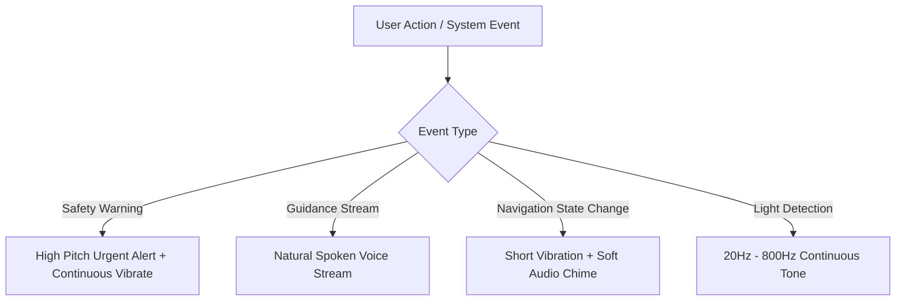

# Accessibility & User Experience (UX) Design System

**Guiden** is built from the ground up as an **audio-first, high-contrast, tactile accessibility platform** tailored for blind and low-vision users.

---

## 1. High-Contrast Color Palette & Visual Tokens

The visual UI employs extreme contrast tokens ([`lib/utils/colors.dart`](file:///c:/Users/ankus/Downloads/guiden/lib/utils/colors.dart)) to remain visible for users with low vision or color vision deficiencies:

| Token Name | Hex Code | Color Sample | Primary Usage |
| :--- | :--- | :--- | :--- |
| `primaryDark` | `#0A0A0E` | Deep Onyx Dark | Main screen background for maximum contrast. |
| `accentYellow` | `#FFE600` | Cyber Yellow | Primary action buttons, target highlights, focus states. |
| `accentCyan` | `#00F0FF` | Electric Cyan | Navigation vectors, active state indicators. |
| `accentRed` | `#FF0055` | Vivid Crimson | Obstacle stop warnings, high-priority safety alerts. |
| `textWhite` | `#FFFFFF` | Pure White | High-contrast body typography. |
| `surfaceDark` | `#16161E` | Dark Card Surface | Interactive container background. |

---

## 2. Cyberpunk NeoPop Tactile UI System

Guiden uses **NeoPop** tactile buttons ([`lib/utils/neo_pop_constants.dart`](file:///c:/Users/ankus/Downloads/guiden/lib/utils/neo_pop_constants.dart)) featuring bold 3D borders and high-shadow offsets.

### Benefits for Low-Vision Users

1. **Definite Physical Boundaries**: Solid 2.5px high-contrast borders provide clear visual boundaries for touch targets.
2. **Tactile Push Depth**: 3D button press animations mimic physical button depression, providing immediate visual feedback.
3. **Large Tap Targets**: All primary interactive elements maintain a minimum target dimension of **56x56 dp**.

---

## 3. Audio-First UX & Haptic Feedback Layer

Because visually impaired users rely heavily on auditory and tactile feedback, Guiden incorporates a multi-tiered audio system:

### Audio Feedback Tiers

| Priority Tier | Audio Mechanism | File / Service Reference | UX Purpose |
| :--- | :--- | :--- | :--- |
| **Urgent Safety** | Custom beep tones + continuous haptics | [`lib/services/global_audio_controller.dart`](file:///c:/Users/ankus/Downloads/guiden/lib/services/global_audio_controller.dart) | Instant warnings for obstacles $< 1.0\text{m}$. |
| **Spoken Guidance** | ElevenLabs / Flutter TTS speech | [`lib/services/tts_service.dart`](file:///c:/Users/ankus/Downloads/guiden/lib/services/tts_service.dart) | Concise 2-4 sentence navigation commands. |
| **Interaction Feedback** | Tactile click chimes + haptic pulse | [`lib/utils/custom_tap.dart`](file:///c:/Users/ankus/Downloads/guiden/lib/utils/custom_tap.dart) | Confirms button taps and view switches. |
| **Light Guidance** | Pitch-modulated square wave | [`lib/modules/light-frequency/light_frequency_controller.dart`](file:///c:/Users/ankus/Downloads/guiden/lib/modules/light-frequency/light_frequency_controller.dart) | Guides users toward light sources. |

---

## 4. Screen Reader & Non-Visual Interaction Guidelines

1. **Semantic Labels**: Every interactive widget includes explicit `Semantics(label: ..., hint: ...)` wrappers for Android TalkBack and iOS VoiceOver compatibility.
2. **Hands-Free Control**: Voice assistant commands can trigger key app features without requiring screen touch.
3. **Screen Timeout Disabled**: Screen timeout is disabled during active navigation sessions to maintain camera image streaming.
