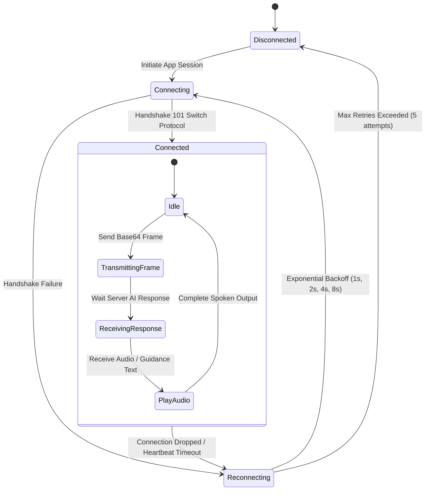

# API & WebSockets Protocol Specification

This document details the real-time communication protocol between the **Guiden Mobile Client** and the **Guiden Python AI Backend Server** (`guiden-server`).

---

## 1. WebSocket Endpoint Overview

- **Protocol**: `ws://` (or `wss://` in production)
- **Host**: `0.0.0.0:8765` (Default local port)
- **Endpoint Path**: `/ws/stream`
- **Full URL Example**: `ws://192.168.1.100:8765/ws/stream`

---

## 2. Client-to-Server Communication

The Flutter mobile app continuously transmits camera stream frames over the open WebSocket connection.

### 2.1 Video Stream Payload Format

Frames are JPEG-encoded, compressed, and encoded into Base64 strings before transmission inside a JSON message:

```json
{
  "type": "frame",
  "timestamp": 1722510000123,
  "image": "/9j/4AAQSkZJRgABAQAAAQABAAD/2wBD...",
  "session_id": "sess_8f92a11b"
}
```

#### Field Specifications

| Field Name | Type | Required | Description |
| :--- | :--- | :--- | :--- |
| `type` | String | Yes | Message type identifier (`"frame"`). |
| `timestamp` | Integer | Yes | Epoch timestamp in milliseconds when frame was captured. |
| `image` | String | Yes | Base64-encoded JPEG image string. |
| `session_id` | String | No | Unique navigation session identifier. |

---

## 3. Server-to-Client Communication

The Python server processes incoming frames using the Gemini 2.0 Flash Vision engine and continuous navigation rules, returning real-time response payloads.

### 3.1 Text Guidance Stream Format

When the server completes visual reasoning, it emits text guidance payloads:

```json
{
  "type": "guidance",
  "status": "success",
  "text": "Path is clear directly ahead. You can take 4 steps forward, then you'll reach the doorway I can see.",
  "obstacle_detected": false,
  "safe_steps": 4
}
```

### 3.2 Audio Payload Format

If ElevenLabs speech synthesis is enabled on the server, synthesized MP3 audio chunks are streamed directly:

```json
{
  "type": "audio",
  "encoding": "mp3",
  "audio_data": "SUQzBAAAAAAAI1RTU0UAAAAPAAADTGFtZTMuO...",
  "duration_ms": 3200
}
```

---

## 4. Connection Lifecycle & Reconnection Strategy



1. **Heartbeat / Ping-Pong**: The client sends periodic `ping` messages every 5 seconds to maintain active socket connection.
2. **Exponential Backoff Reconnection**: In the event of network disruption, the client attempts auto-reconnection at intervals of 1s, 2s, 4s, 8s up to 5 attempts before notifying the user via audio prompt (*"Server connection lost. Retrying..."*).
