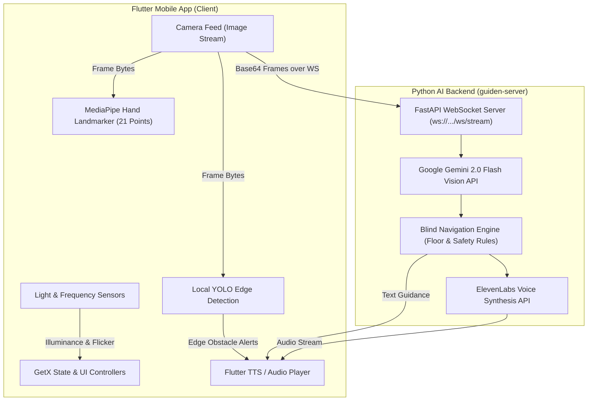
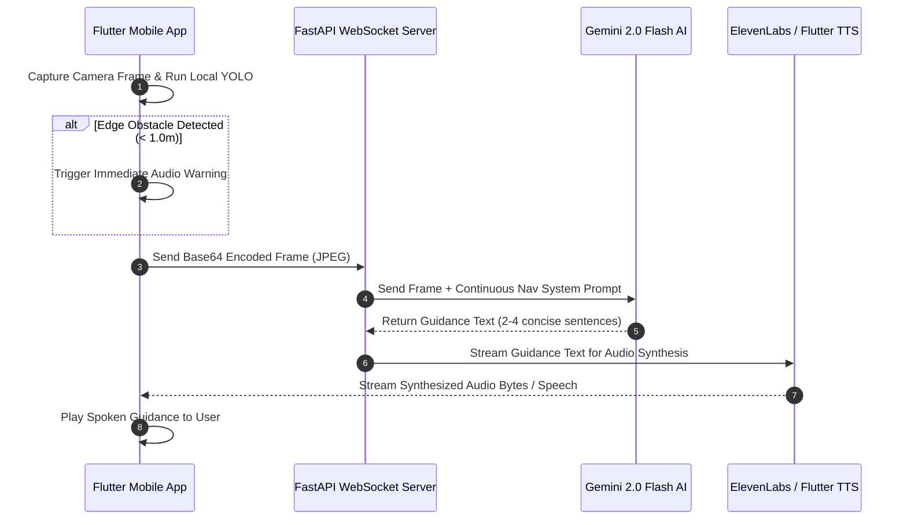

# System Architecture

**Guiden** is an AI-powered assistive technology platform designed to empower visually impaired and blind users with continuous real-time spatial awareness, step-by-step navigation guidance, obstacle detection, ambient lighting sensing, and tactile gesture controls.

---

## 1. High-Level Architecture Overview

The system consists of two primary tiers:
1. **Flutter Mobile Application** (`/lib`): High-performance cross-platform mobile client providing camera frame capture, local edge AI processing (YOLO object detection & MediaPipe Hand Landmarker), light frequency sensing, text-to-speech feedback, and GetX state management.
2. **Python AI Server** (`/guiden-server`): Real-time FastAPI WebSocket server processing high-resolution camera streams, evaluating spatial context with Gemini 2.0 Flash Vision AI, enforcing strict continuous navigation safety rules, and generating ElevenLabs natural audio response streams.

---

## 2. Component Specifications

### 2.1 Mobile Application Tier (Flutter)

The mobile client is architected around **GetX** for reactive state management, clean route navigation, and dependency injection.

| Subsystem / Service | File Path | Core Functionality |
| :--- | :--- | :--- |
| **Guided Camera View** | [`lib/modules/guider/camera/guided_camera_view.dart`](file:///c:/Users/ankus/Downloads/guiden/lib/modules/guider/camera/guided_camera_view.dart) | Real-time viewport rendering, frame sampling, live audio indicators, and navigation overlay. |
| **YOLO Model Manager** | [`lib/services/yolo_model_manager.dart`](file:///c:/Users/ankus/Downloads/guiden/lib/services/yolo_model_manager.dart) | On-device object detection for instant edge obstacle alerts (chairs, tables, doors, vehicles, pedestrians). |
| **Hand Detector** | [`lib/services/hand_detector.dart`](file:///c:/Users/ankus/Downloads/guiden/lib/services/hand_detector.dart) | MediaPipe Hand Landmarker tracking 21 keypoints per hand for touch-free gesture inputs and physical targeting. |
| **Voice Assistant** | [`lib/services/voice_assistant_controller.dart`](file:///c:/Users/ankus/Downloads/guiden/lib/services/voice_assistant_controller.dart) | Conversational voice UI integrating `speech_to_text` and `flutter_tts` with hands-free operation. |
| **Light Frequency** | [`lib/modules/light-frequency/light_frequency_controller.dart`](file:///c:/Users/ankus/Downloads/guiden/lib/modules/light-frequency/light_frequency_controller.dart) | Ambient illuminance (Lux) and lighting flicker rate detection for locating light sources and windows. |
| **Global Audio** | [`lib/services/global_audio_controller.dart`](file:///c:/Users/ankus/Downloads/guiden/lib/services/global_audio_controller.dart) | Haptic & sound effect dispatching for navigation state changes and safety alerts. |

---

### 2.2 Server Tier (Python & FastAPI)

The server tier handles heavy multimodal Vision AI reasoning and natural voice generation.

| Server Component | File Path | Responsibilities |
| :--- | :--- | :--- |
| **Assist Server** | [`guiden-server/assist_server.py`](file:///c:/Users/ankus/Downloads/guiden/guiden-server/assist_server.py) | FastAPI WebSocket endpoint handling low-latency camera frame streams, Gemini Vision context assembly, and streaming audio payloads back to the client. |
| **Blind Navigation Engine** | [`guiden-server/blind_navigation.py`](file:///c:/Users/ankus/Downloads/guiden/guiden-server/blind_navigation.py) | Enforces floor-first priority rules, conservative safe-distance bounds, and step-by-step guidance prompts. |
| **Navigation System Prompt** | [`hand_landmarker.MD`](file:///c:/Users/ankus/Downloads/guiden/hand_landmarker.MD) | Continuous navigation prompt guarding against visual hallucinations and enforcing step bounds based strictly on visible obstacles. |

---

## 3. Data Flow & Pipeline Architecture

---

## 4. Key Design Principles

1. **Accessibility First**: Designed specifically for non-visual interactions utilizing spoken audio, spatial haptics, and high-contrast Cyberpunk NeoPop UI components.
2. **Hybrid Edge & Cloud AI**: Local low-latency edge inference (YOLO + MediaPipe) for immediate obstacle warnings paired with Cloud Multimodal LLMs (Gemini 2.0 Flash) for semantic room comprehension.
3. **Safety & Non-Hallucination**: Conservative step limits calculated strictly from visible ground clearance to prevent false directions in unobserved areas.
