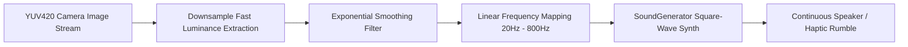
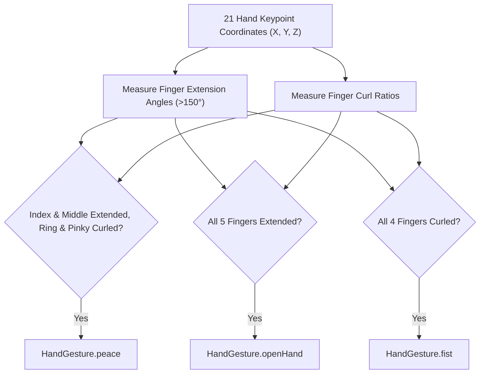

# Light & Gesture Sensing Algorithms

**Guiden** integrates novel non-visual sensing capabilities to provide blind users with non-intrusive spatial awareness through audio pitch modulation and touch-free hand gesture detection.

---

## 1. Light Frequency & Illuminance Sensing

The Light Frequency feature ([`lib/modules/light-frequency/light_frequency_controller.dart`](file:///c:/Users/ankus/Downloads/guiden/lib/modules/light-frequency/light_frequency_controller.dart)) transforms ambient camera brightness into real-time audio pitch sweeps. This allows blind users to scan rooms for light sources (such as open windows, lamps, or TV screens) by listening to and feeling pitch variations.



### 1.1 Fast Luminance Extraction Algorithm

To run at 60 FPS without UI stutter, the controller samples the Y-plane (luminance) of `YUV420` camera images with a stride step of 20 columns and 5 rows:

$$\text{Brightness } (b) = \frac{1}{N} \sum_{r, c} Y[r, c] \div 255.0$$

```dart
double _calculateBrightnessFast(CameraImage image) {
  final plane = image.planes[0]; // Y-plane (luminance)
  final bytes = plane.bytes;
  final stride = plane.bytesPerRow;
  int sum = 0, count = 0;

  for (int row = 0; row < image.height; row += 5) {
    final rowStart = row * stride;
    for (int col = 0; col < stride; col += 20) {
      if (rowStart + col < bytes.length) {
        sum += bytes[rowStart + col];
        count++;
      }
    }
  }
  return count > 0 ? (sum / count) / 255.0 : 0.0;
}
```

### 1.2 Exponential Brightness Smoothing

To prevent abrupt audio jitter, an exponential moving average (EMA) filter is applied:

$$B_{\text{smoothed}} = \alpha \cdot b + (1 - \alpha) \cdot B_{\text{smoothed}}$$

where smoothing factor $\alpha = 0.25$.

### 1.3 Frequency Pitch & Bass Sweep Mapping

The smoothed brightness $B_{\text{smoothed}} \in [0.0, 1.0]$ maps directly to a square-wave frequency range of **20 Hz to 800 Hz**:
- **0.0 Brightness (Pitch Dark)**: **20 Hz** — Deep bass physical speaker rumble/vibration felt through the phone body.
- **1.0 Brightness (Direct Sunlight/Lamp)**: **800 Hz** — High clear audible tone.

$$\text{Frequency (Hz)} = 20.0 + (B_{\text{smoothed}} \cdot 780.0)$$

---

## 2. MediaPipe Hand Landmark & Gesture Detection

The Hand Detector service ([`lib/services/hand_detector.dart`](file:///c:/Users/ankus/Downloads/guiden/lib/services/hand_detector.dart)) uses MediaPipe Hand Landmarker to track 21 3D joint keypoints per hand.



### 2.1 MediaPipe Landmark Mapping

```
     THUMB          INDEX         MIDDLE         RING          PINKY
       4              8             12            16            20
       |              |              |             |             |
       3              7             11            15            19
       |              |              |             |             |
       2              6             10            14            18
        \            /               |             |            /
         1 -------- 5 -------------- 9 ----------- 13 -------- 17
                     \               |            /
                      ----------------0-----------
                                    WRIST
```

### 2.2 Finger Extension & Angle Calculations

A finger is deemed **extended** when the 3D joint angle at the Proximal Interphalangeal (PIP) joint exceeds **150°** and the distance from tip to wrist is greater than PIP to wrist:

$$\text{Angle } \theta = \arccos\left(\frac{AB^2 + BC^2 - AC^2}{2 \cdot AB \cdot BC}\right) \times \frac{180}{\pi} > 150^\circ$$

### 2.3 Supported Touch-Free Gestures

| Gesture | Landmark Condition | App Trigger Action |
| :--- | :--- | :--- |
| **Open Hand** (`HandGesture.openHand`) | All 5 fingers extended. | Pause / Resume continuous navigation guidance stream. |
| **Fist** (`HandGesture.fist`) | Index, middle, ring, pinky curled toward palm. | Re-orient / Reset spatial origin frame. |
| **Peace Sign** (`HandGesture.peace`) | Index & middle extended with spread $> 0.8 \times \text{MCP distance}$; ring & pinky curled. | Toggle obstacle detection mode or capture frame. |
