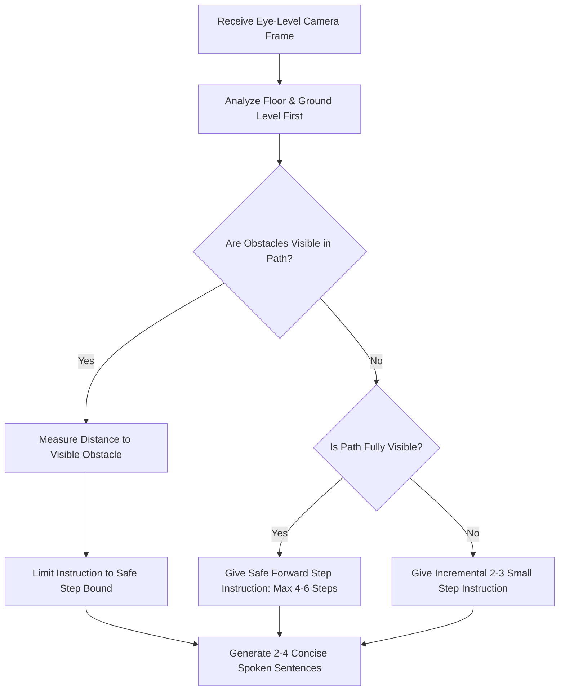
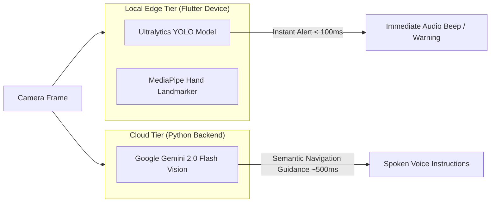

# Navigation AI Engine

The **Navigation AI Engine** is the core spatial intelligence subsystem of **Guiden**, powering continuous, safe, and reliable step-by-step navigation for blind and visually impaired users.

---

## 1. System Prompt Rules & Safety Constraints

The navigation engine operates under a strict continuous navigation safety protocol defined in [`hand_landmarker.MD`](file:///c:/Users/ankus/Downloads/guiden/hand_landmarker.MD). The AI assistant functions as the user's eyes, analyzing continuous eye-level video stream frames.

### Core Safety Directives

1. **Floor Analysis Priority**: The assistant must always evaluate the lower region of the image first (the walkable ground surface) to verify path clearage before observing background structures.
2. **Conservative Incremental Instructions**:
   - Limit safe step guidance to **visible clear floor distance only**.
   - Issue concise commands limited to **2 to 4 sentences maximum**.
   - State exact step boundaries based on visible items (e.g., *"You can take 3 steps forward, then you will reach the chair I can see."*).
3. **Anti-Hallucination Constraints**:
   - Only describe objects clearly visible in the current camera frame.
   - **Never assume** obstacles exist outside the visible camera view.
   - Avoid speculative language such as *"maybe"*, *"possibly"*, or *"seems to be"*.
   - If visibility is obscured or limited, instruct the user to take 2 small steps and send a new image.

---

## 2. Distance Estimation & Categorization

Distances to visible obstacles are estimated in human step units:

| Obstacle Distance Category | Step Units | Action Prompt Strategy |
| :--- | :--- | :--- |
| **Very Close** | 1 – 2 Steps | Immediate stop or directional pivot command. |
| **Close** | 3 – 4 Steps | Guided step boundary with explicit target object naming. |
| **Medium** | 5 – 6 Steps | Clear path confirmation with maximum step limit. |
| **Limited Visibility** | Unclear / Cut Off | Cautionary small steps (2 steps), requesting next frame update. |

---

## 3. Dual-Layer AI Architecture

Guiden employs a **dual-layer AI architecture** combining cloud-based multimodal reasoning with local low-latency edge model inference:

### 3.1 Cloud Layer: Gemini 2.0 Flash Vision
- **Endpoint**: Integrated into [`guiden-server/assist_server.py`](file:///c:/Users/ankus/Downloads/guiden/guiden-server/assist_server.py).
- **Function**: Receives JPEG frames streaming over WebSockets, processes image context alongside `hand_landmarker.MD` system directives, and generates natural language guidance.

### 3.2 Edge Layer: Ultralytics YOLO & TFLite
- **Manager**: Executed locally via [`lib/services/yolo_model_manager.dart`](file:///c:/Users/ankus/Downloads/guiden/lib/services/yolo_model_manager.dart).
- **Function**: Performs real-time object detection (chairs, tables, people, doors, steps) directly on the phone's GPU/NPU at 30–60 FPS.
- **Role**: Provides instant fallback safety alerts if an obstacle suddenly enters the user's path before the cloud server responds.

---

## 4. Spoken Output Examples

| Scenario | Generated Spoken Output |
| :--- | :--- |
| **Blocked Path (Visible Alternative)** | *"Stop. There's a bed 2 steps directly ahead. The floor on your left looks clear. Step 3 feet to your left."* |
| **Clear Visible Path** | *"Path is clear directly ahead. You can take 4 steps forward, then you'll reach the doorway I can see."* |
| **Limited Visibility** | *"Take 2 careful steps forward. I can't see far enough ahead yet. Send me the next image after you move."* |
| **Uncertain Safety** | *"Stop. I'm checking the path ahead. Hold position."* |
